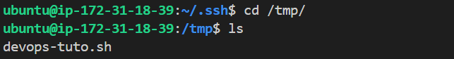
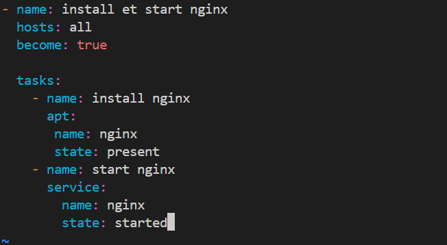
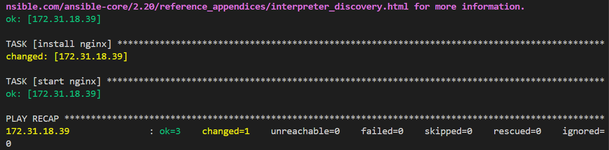
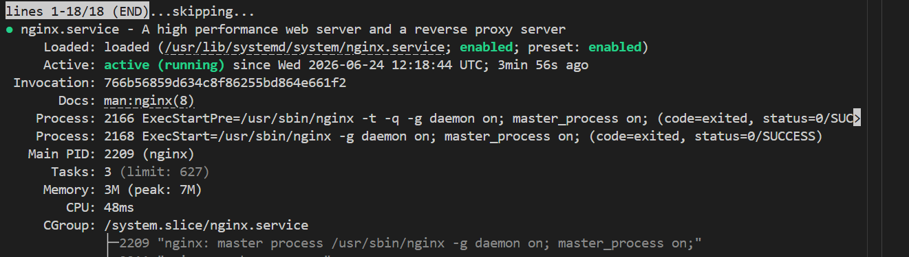
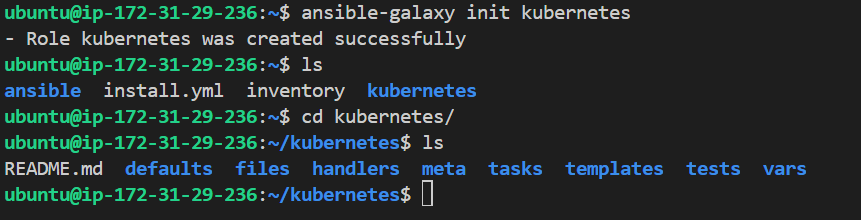

## installation ansible

    sudo apt install ansible
* Generate ssh-keys with ssh-keygen
* Create ansible folder
       mkdir ansible
* Create inventory.ini file 172.31.18.39

* ad-hoc pour les taches simples
      ansible -i inventory all -m shell -a "touch /tmp/devops-tuto.sh"
      -   

* install nginx on remote server with playbook on master serveur
     ansible-playbook -i inventory install-nginx.yml

     -   
     
     -   

     - 
      
* execute and get all details about installation

      ansible-playbook -i inventory install.yml -v

* Roles Ansible
   Permet d'organiser nos taches ansibles 
   Structure organisation de fichiers pour faciliter la reutilisation et maintenances de codes
        
        ansible-galaxy init kubernetes(role-name)

    - 

   - tasks: Contient toutes les taches a executer 
   - handlers: Contient les getionnaires d'evenements
   - templates: Contient les templates: jinja2
   - files: contient toutes les fichiers a organiser
   - vars: Contient les variables utiliser
   - default: Contient les valeurs par defaut

excution role command
    ansible-playbook -i inventory kubernetes.yml
# Questions interview
 playbook: est un fichier yamldans laquelle est decrite un serie de taches a executer sur une machine(organisation et planifications des taches,)
 Had-oc: ce sont des commandes qui permettent l'execution des actions simples

 roles: est une collection organiser de playbook, de fichiers, de variables et de gestionaire permettant une meilleure organisation et reutilisation de code

 tasks et handlers(contient les actions qui sont appeles uniquement en cas de changement)

 Pour deboguer un playbook ansible , on utilise (-v) pour obtenir plus de details