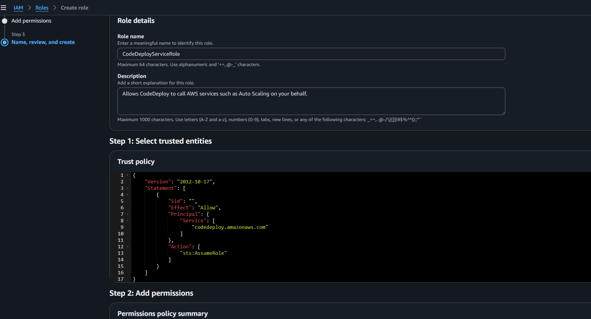
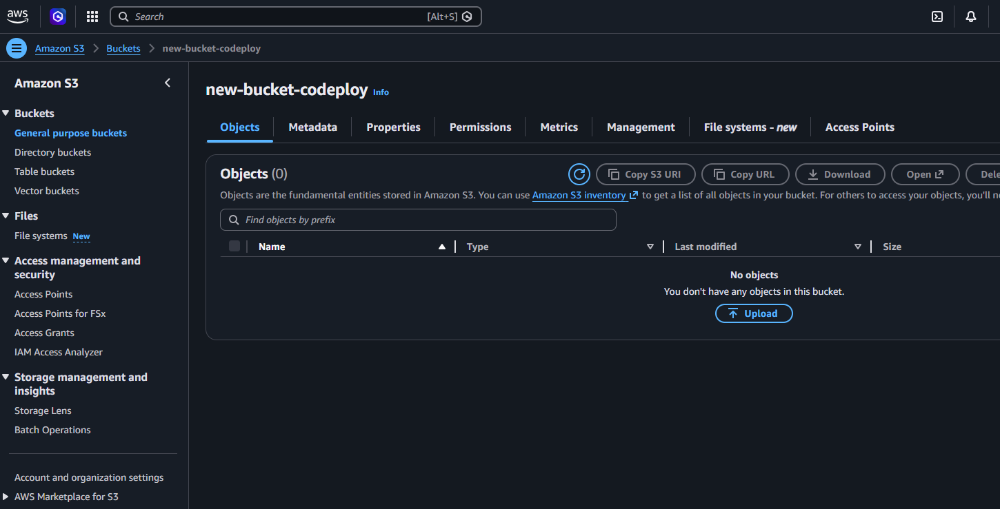
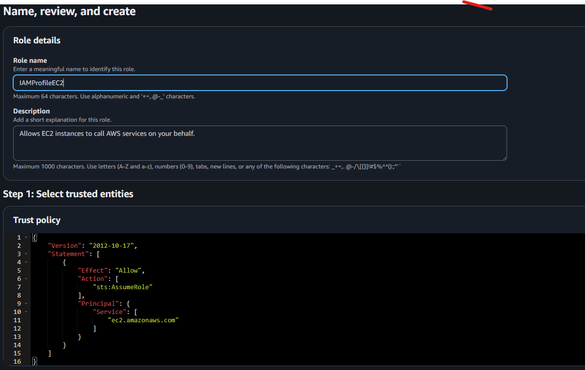

## Configurer AWS CodeDeploy en effectuant les etapes:

  - Creer un compte avec des permissions limitees. access programmatioque IAM
  - Configurer un role de service pour CodeDeploy
     Role est un service permettre a un service(Service) aws d'acceder a d'autres services AWS
     -   
      
  - Restreindre les permissions attribuees a CodeDeploy.

  - Creer un profil d'instance IAM pour Amazon EC2
   iAM Instance Profile

     * Create S3 bucket to get artifacts (arn:aws:s3:::new-bucket-codeploy)
            -  

     * Create policy
     -  

     * Attach policy to a role
     * Role will be attach to ec2 to access S3  bucket

      -  

      * Instance codeDeployAgent