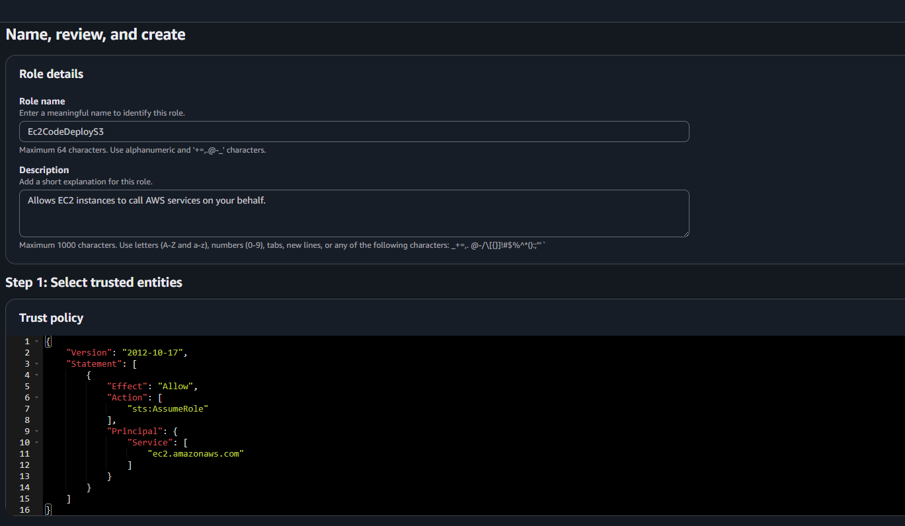
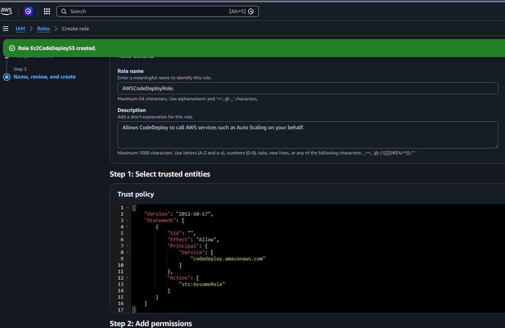
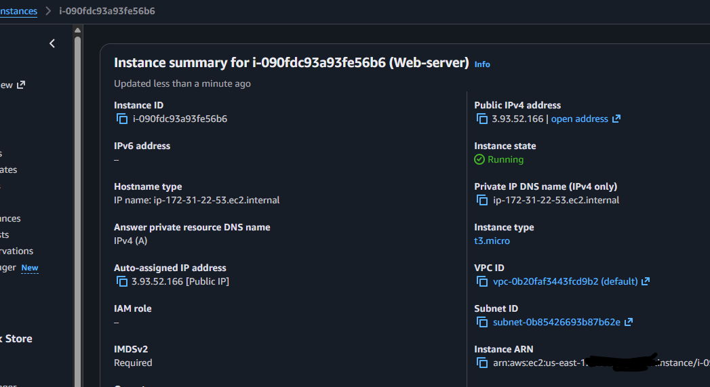
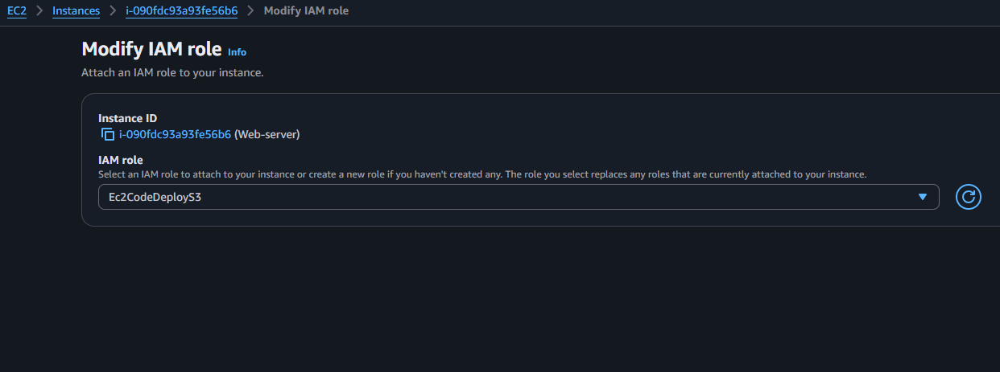
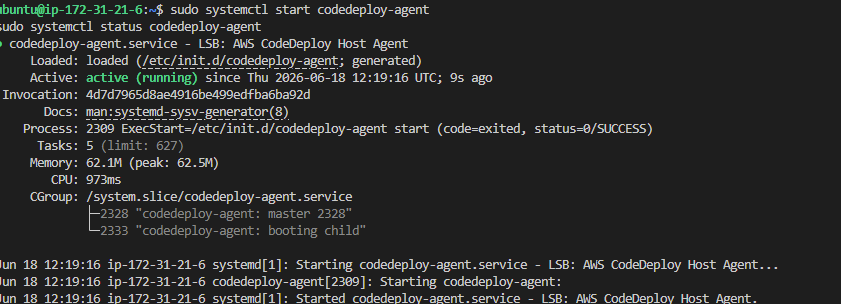
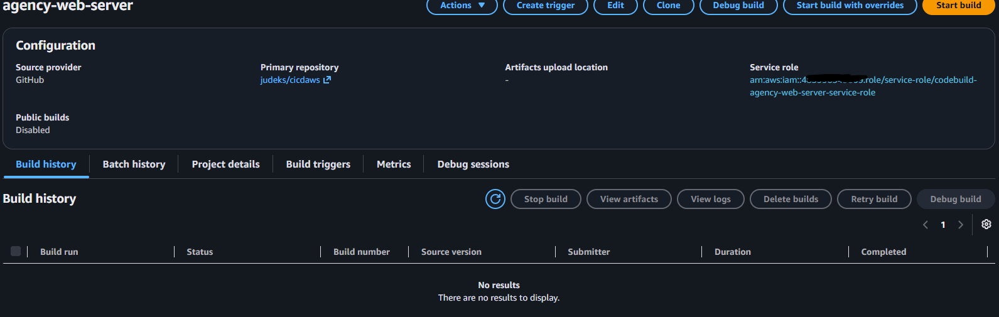
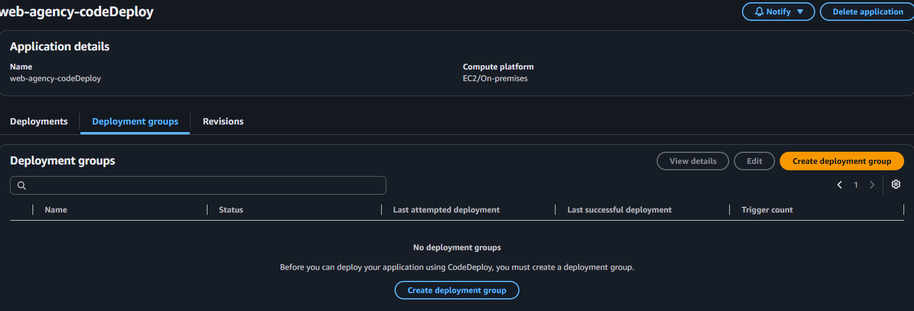
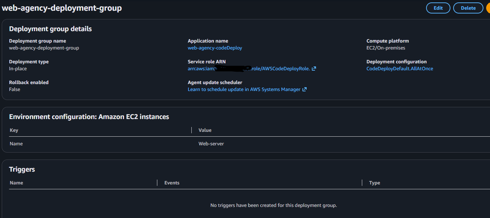
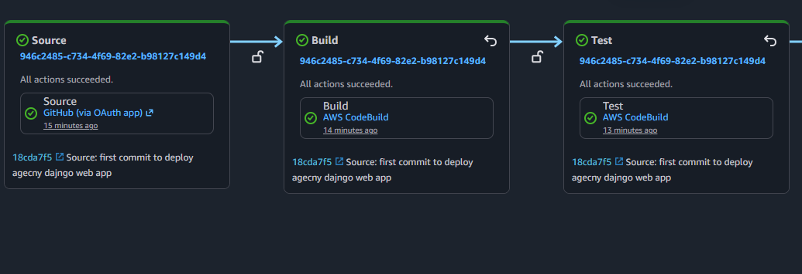

## Deployment IN-placemnt deployment

!-creer un role pour ec2
-     

2- Role pour codeDeploy

2-role-for-codedeploy

   -     

3- Launch one ubuntu instance EC2 Name: Web-server

-    

4- Assign role to instance EC2 Name: Web-server and reboot it

-   

5- Install a codeDeploy Agent

    * Connect to ec2 instance through ssh
    * Mettez à jour le système
        sudo apt update 
        sudo apt install ruby-full wget -y 
        download agent: 
        -  wget https://Bucket-name.s3.Regionidentifier.amazonaws.com/latest/install
           wget https://aws-codedeploy-us-east-1.s3.us-east-1.amazonaws.com/latest/install
        - https://docs.aws.amazon.com/codedeploy/latest/userguide/resource-kit.html

    * Donner la permission d'execution au fichier de l'agent
             chmod +x ./install 
    * Installer l'agent sur EC2

          sudo ./install auto > /tmp/logfile 

          Problem installation fixed

             Inject '3.3' into the script's supported versions array
                  sed -i "s/\['3.2','3.1','3.0'/['3.3','3.2','3.1','3.0'/" ./install
                  sudo ./install auto
             
             Download the .deb package file directly
                  wget https://aws-codedeploy-us-east-1.s3.us-east-1.amazonaws.com/releases/codedeploy-agent_1.8.1-26_all.deb
             Force the installation by ignoring dependencies:
                  sudo dpkg -i --force-depends codedeploy-agent_1.8.1-26_all.deb

             Start and Verify the Service
                  sudo systemctl start codedeploy-agent
                  sudo systemctl status codedeploy-agent

  

6- Configure project
7- Mettre en place AWS pipeline avec codePipeline
   * Create build
     
  * codeDeploy
     
  * Deployment-group
     8-b-deployment-group
       
  * Create pipeline
       

